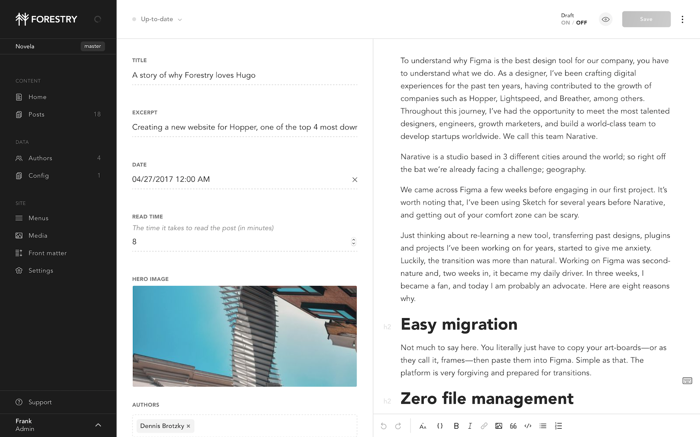

[](https://app.netlify.com/sites/hugo-novela-forestry/deploys)

# Hugo Novela Forestry Starter

A port of [Narative](https://www.narative.co/)'s Gatsby theme [Novela](https://www.narative.co/labs/novela/)


<a href="https://app.forestry.io/quick-start?repo=forestryio/novela-hugo-starter&engine=hugo&version=0.62.2">
    
</a>

## Prerequisites

- Hugo > 0.55.0

## Content Management



This project has been pre-configured to work with [Forestry](https://forestry.io), just import your repository ✨. \
Any changes you make will be commited back to the repo, and deployed if you're using Netlify.

## Deployment and hosting with Netlify

Import your site in [Netlify](https://netlify.com)

1. Create a new site in Netlify and import your repository.
2. Set the build command to: `hugo --gc --minify`
3. Set the publish directory to: `public`
4. Make sure to set `HUGO_VERSION` to 0.55.0 or above (tested with 0.62.2)

That's it, now your site gets deployed automatically on `git push` or when saving documents from Forestry.

## Development

```bash
# clone the repository
git clone git@github.com:forestryio/novela-hugo-starter.git

# cd in the project directory
cd novela-hugo-starter

# Start local dev server
hugo server
```

For more information, see [official Hugo documentation](https://gohugo.io/getting-started/).

## Customization

### Logo

Add to your projects layout directory your logo's SVG:
`/layouts/icons/ui/logo.html`

### Socials

In order for the Socials to be surfaced in Forestry, you should copy the theme's `config/_default/social.yaml` to your project.

### Authors

You should register authors as a taxonomy in your project's `config.yaml``

```yaml
taxonomies:
  author: authors
```

#### Creating authors

Add a similar file to your content directory and Front Matter example.

```yaml
# /content/authors/firstname-lastname/_index.md
---
title: Dennis Brotzky
bio: |
  Written by You. This is where your author bio lives. Share your work, your
  joys and of course, your Twitter handle.
avatar: /images/dennis-brotzky.jpg
featured: true
social:
  - title: github
    url: https://github.com
  - title: twitter
    url: https://twitter.com
  - title: instagram
    url: https://instagram.com
  - title: dribbble
    url: https://dribbble.com
  - title: unsplash
    url: https://unsplash.com
---
```

#### Assigning authors to posts.
Add the name of the author to the "authors" field:

```yaml
authors:
  - Dennis Brotzky
  - Thiago Costa
```
### Newsletter call to action

This theme includes a shortcode for a newsletter callout form that you can add to any page.
It uses [formspree.io](//formspree.io/) as proxy to send the actual email. Each month, visitors can send you up to one thousand emails without incurring extra charges. Visit the Formspree site to get get going add your Formspree email to your shortcode like this:

```

```


## LICENSE

MIT
